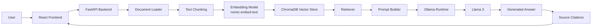
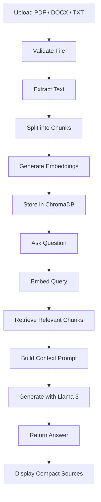

<div align="center">

# Intelligent Document Assistant using Local RAG and Llama 3

### A local-first AI document assistant built with FastAPI, React, ChromaDB, Ollama, and Llama 3.


</div>

---

## 📌 Overview

**Intelligent Document Assistant using Local RAG and Llama 3** is a full-stack document question-answering system that runs locally using Ollama, Llama 3, ChromaDB, FastAPI, SQLite, and React.

Unlike a traditional chatbot that answers only from model memory, this project uses **Retrieval-Augmented Generation (RAG)**. Uploaded documents are extracted, chunked, embedded, stored in a vector database, retrieved semantically, and then passed to Llama 3 as context for grounded answers.

> Built for privacy-focused document intelligence, local AI experimentation, placement portfolios, and production-style AI engineering demonstrations.

---

## ✨ Features

- 🔒 Local Llama 3 inference using Ollama
- 🧠 Retrieval-Augmented Generation pipeline
- 📄 Multi-document upload
- 📘 PDF support with page-aware references
- 📝 DOCX support
- 📃 TXT support
- 🔎 Semantic search using ChromaDB
- 🧬 Local embeddings using `nomic-embed-text`
- 💾 SQLite chat history
- 💬 Multiple chat sessions
- 📚 Source citations with compact excerpts
- 🎯 Document filtering before retrieval
- ➕ Upload more documents without deleting existing files
- 🗑️ Delete individual documents and their vectors
- 🧹 Delete all indexed documents
- ⚡ FastAPI backend
- ⚛️ React + Vite frontend
- 🎨 Tailwind CSS responsive UI
- ⚙️ Environment-based configuration

---

## 📚 Table of Contents

- [System Architecture](#-system-architecture)
- [RAG Pipeline](#-rag-pipeline)
- [Project Workflow](#-project-workflow)
- [Tech Stack](#-tech-stack)
- [Project Structure](#-project-structure)
- [Installation](#-installation)
- [Environment Variables](#-environment-variables)
- [API Documentation](#-api-documentation)
- [How RAG Works](#-how-rag-works)
- [Design Principles](#-design-principles)
- [Performance Optimizations](#-performance-optimizations)
- [Screenshots](#-screenshots)
- [Future Enhancements](#-future-enhancements)
- [Author](#-author)
- [License](#-license)

---

## 🏗️ System Architecture



---

## 🔁 RAG Pipeline



---

## 🧭 Project Workflow

1. User uploads one or more supported documents.
2. Backend validates file type, size, duplicate uploads, and empty files.
3. Text is extracted from PDF, DOCX, or TXT documents.
4. Extracted text is split into smaller chunks.
5. Chunks are embedded using `nomic-embed-text` through Ollama.
6. Embeddings and metadata are stored in ChromaDB.
7. User asks a question in the frontend.
8. The query is embedded and matched against stored vectors.
9. Relevant document chunks are retrieved.
10. Retrieved context is passed to Llama 3.
11. Llama 3 generates a grounded answer.
12. The UI displays the answer with source citations.

---

## 🧰 Tech Stack

| Technology | Purpose | Why It Was Used |
|---|---|---|
| Python | Backend language | Strong AI and API ecosystem |
| FastAPI | REST backend | Fast, modern, typed API framework |
| React | Frontend UI | Component-based interface |
| Vite | Frontend tooling | Fast development and builds |
| Tailwind CSS | Styling | Responsive utility-first design |
| Axios | API communication | Simple HTTP client |
| Ollama | Local model runtime | Runs LLMs locally |
| Llama 3 | Answer generation | Local language model |
| nomic-embed-text | Embeddings | Local semantic embeddings |
| ChromaDB | Vector database | Persistent semantic search |
| SQLite | Chat history | Lightweight local persistence |
| SQLAlchemy | ORM | Structured database access |
| PyPDF | PDF extraction | Page-aware PDF text extraction |
| python-docx | DOCX extraction | Word document parsing |

---

## 📁 Project Structure

```text
Local RAG with LLaMa3/
├── backend/
│   ├── config.py              # Environment configuration and defaults
│   ├── database.py            # SQLite models, sessions, chat history
│   ├── document_loader.py     # PDF, DOCX, TXT extraction and chunking
│   ├── embeddings.py          # Ollama embedding integration
│   ├── llm.py                 # Llama 3 response generation
│   ├── main.py                # FastAPI app and API routes
│   ├── rag.py                 # RAG orchestration and citations
│   ├── requirements.txt       # Python dependencies
│   └── vector_store.py        # ChromaDB vector operations
│
├── frontend/
│   ├── index.html             # Vite entry point
│   ├── package.json           # React dependencies and scripts
│   ├── postcss.config.js      # PostCSS setup
│   ├── tailwind.config.js     # Tailwind configuration
│   └── src/
│       ├── App.jsx            # Main React application
│       ├── main.jsx           # React entry file
│       ├── styles.css         # Tailwind imports and global styles
│       ├── components/
│       │   ├── Alert.jsx
│       │   ├── ChatInput.jsx
│       │   ├── MessageList.jsx
│       │   ├── Sidebar.jsx
│       │   ├── Spinner.jsx
│       │   ├── Toast.jsx
│       │   ├── TopBar.jsx
│       │   └── UploadPanel.jsx
│       ├── services/
│       │   └── api.js         # Axios backend API layer
│       └── utils/
│           └── format.js      # Formatting and citation helpers
│
├── chroma_db/                 # Persistent vector database
├── uploads/                   # Uploaded documents
├── .env                       # Local environment variables
├── .env.example               # Example environment file
├── .gitignore
├── README.md
└── rag_history.sqlite3        # SQLite chat history database
```

---

## ⚙️ Installation

### 1. Clone the Repository

```bash
git clone <your-repository-url>
cd "Local RAG with LLaMa3"
```

### 2. Create a Python Virtual Environment

```bash
cd backend
python -m venv .venv
```

```powershell
.\.venv\Scripts\Activate.ps1
```

### 3. Install Backend Dependencies

```bash
pip install -r requirements.txt
```

### 4. Install Frontend Dependencies

```bash
cd ../frontend
npm install
```

### 5. Install Ollama

Download Ollama from:

```text
https://ollama.com/download
```

### 6. Pull Required Models

```bash
ollama pull llama3
ollama pull nomic-embed-text
```

### 7. Create Environment File

```bash
copy .env.example .env
```

### 8. Run Backend

```bash
cd backend
uvicorn main:app --reload
```

Backend URL:

```text
http://127.0.0.1:8000
```

### 9. Run Frontend

```bash
cd frontend
npm run dev
```

Frontend URL:

```text
http://127.0.0.1:5173
```

---

## 🔐 Environment Variables

| Variable | Purpose | Default |
|---|---|---|
| `APP_NAME` | FastAPI application name | `Local RAG with Llama 3` |
| `OLLAMA_BASE_URL` | Ollama server URL | `http://localhost:11434` |
| `LLM_MODEL` | LLM used for generation | `llama3` |
| `EMBEDDING_MODEL` | Embedding model | `nomic-embed-text` |
| `UPLOAD_DIR` | Uploaded file directory | `uploads` |
| `CHROMA_DB_DIR` | ChromaDB storage path | `chroma_db` |
| `DATABASE_PATH` | SQLite database path | `rag_history.sqlite3` |
| `DATABASE_URL` | Optional SQLAlchemy URL override | Not set |
| `CHROMA_COLLECTION` | ChromaDB collection name | `local_documents` |
| `CHUNK_SIZE` | Text chunk size | `900` |
| `CHUNK_OVERLAP` | Chunk overlap | `150` |
| `RETRIEVAL_K` | Number of retrieved chunks | `5` |
| `MAX_RELEVANCE_DISTANCE` | Retrieval relevance cutoff | `1.35` |
| `MAX_UPLOAD_SIZE_MB` | Max file upload size | `50` |
| `ALLOWED_EXTENSIONS` | Supported file types | `.pdf,.docx,.txt` |

---

## 📡 API Documentation

| Method | Endpoint | Description |
|---|---|---|
| `GET` | `/health` | Check backend, ChromaDB, and Ollama health |
| `POST` | `/upload` | Upload and index one or more documents |
| `POST` | `/ask` | Ask a question over indexed documents |
| `GET` | `/documents` | List indexed documents |
| `DELETE` | `/documents` | Delete all indexed documents |
| `DELETE` | `/document/{filename}` | Delete one document and its vectors |
| `GET` | `/history` | Retrieve chat history and sessions |
| `DELETE` | `/history` | Clear chat history |
| `POST` | `/sessions` | Create a new chat session |
| `GET` | `/sessions/{session_id}` | Retrieve session messages |

---

## 🧠 How RAG Works

1. **Upload** documents from the frontend.
2. **Extract** readable text from each file.
3. **Chunk** long text into smaller sections.
4. **Embed** chunks using `nomic-embed-text`.
5. **Store** vectors and metadata in ChromaDB.
6. **Embed** the user question.
7. **Retrieve** semantically relevant chunks.
8. **Build** a context-aware prompt.
9. **Generate** an answer using Llama 3.
10. **Cite** sources in the UI.

---

## 🎯 Design Principles

- Modular backend architecture
- Clear separation of concerns
- Local-first AI execution
- Retrieval-grounded answers
- Explainable responses through citations
- Environment-based configuration
- Reusable frontend components
- Persistent local storage
- Minimal and professional UI

---

## ⚡ Performance Optimizations

| Area | Optimization |
|---|---|
| Chunking | Splits large documents into searchable units |
| Retrieval | Sends only relevant chunks to the LLM |
| Vector Search | Uses ChromaDB for fast semantic matching |
| Hallucination Reduction | Grounds answers in retrieved document text |
| Local Inference | Avoids external API latency |
| Persistence | Reuses stored vectors and chat history |

---

## 🖼️ Screenshots

### Home Page

_Add screenshot here_

### Document Upload

_Add screenshot here_

### Chat Interface

_Add screenshot here_

### Source Citations

_Add screenshot here_

### Sidebar

_Add screenshot here_

---

## 🚧 Future Enhancements

- OCR support for scanned PDFs
- Streaming responses
- Hybrid keyword + vector search
- User authentication
- Document collections
- Cloud deployment
- Voice interaction
- Chat export
- Advanced document preview
- Retrieval evaluation dashboard

---

## 👩‍💻 Author

**Jahnavi Polisetty**

---

## 📄 License

This project is licensed under the **MIT License**.
## Prerequisites

- Python 3.10+
- Node.js 18+
- Ollama installed and running

## Environment Configuration

Backend configuration is loaded from the root `.env` file by `backend/config.py` using `python-dotenv`. All other backend modules import settings from `config.py`; they should not hardcode model names, paths, database locations, or Ollama URLs.

Create your local environment file from the example:

```bash
copy .env.example .env
```

macOS/Linux:

```bash
cp .env.example .env
```

Available variables:

```bash
APP_NAME=Local RAG with Llama 3
OLLAMA_BASE_URL=http://localhost:11434
LLM_MODEL=llama3
EMBEDDING_MODEL=nomic-embed-text
UPLOAD_DIR=uploads
CHROMA_DB_DIR=chroma_db
DATABASE_PATH=rag_history.sqlite3
CHROMA_COLLECTION=local_documents
CHUNK_SIZE=900
CHUNK_OVERLAP=150
RETRIEVAL_K=5
MAX_RELEVANCE_DISTANCE=1.35
MAX_UPLOAD_SIZE_MB=50
PDF_EXTENSION=.pdf
DOCX_EXTENSION=.docx
TXT_EXTENSION=.txt
ALLOWED_EXTENSIONS=.pdf,.docx,.txt
```

`DATABASE_URL` can also be set for a full SQLAlchemy database URL. If omitted, the app uses `DATABASE_PATH` and builds a SQLite URL automatically.

All path values may be absolute or relative. Relative paths are resolved from the project root.

## Ollama Setup

Install Ollama from https://ollama.com/download, then start Ollama and pull the required models:

```bash
ollama pull llama3
ollama pull nomic-embed-text
```

Confirm Ollama is available:

```bash
ollama list
```

## Backend Setup

From the project root:

```bash
cd backend
python -m venv .venv
```

Activate the virtual environment.

Windows PowerShell:

```powershell
.\.venv\Scripts\Activate.ps1
```

macOS/Linux:

```bash
source .venv/bin/activate
```

Install backend dependencies:

```bash
pip install -r requirements.txt
```

Run the FastAPI backend:

```bash
uvicorn main:app --reload
```

Backend API docs will be available at:

```text
http://127.0.0.1:8000/docs
```

## Frontend Setup

From the project root:

```bash
cd frontend
npm install
npm run dev
```

## API Endpoints

- `POST /upload` uploads and indexes PDF, DOCX, or TXT files.
- `POST /ask` asks a question using the indexed documents.
- `GET /history` returns chat history.
- `DELETE /history` clears chat history.
- `GET /documents` lists indexed documents.
- `DELETE /documents` deletes all indexed documents.
- `DELETE /document/{filename}` deletes one document and its vectors.
- `GET /health` returns backend and vector-store health.
