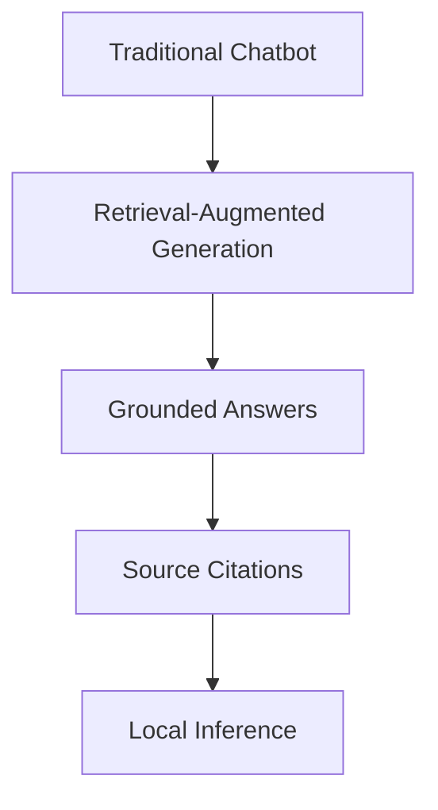
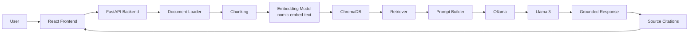
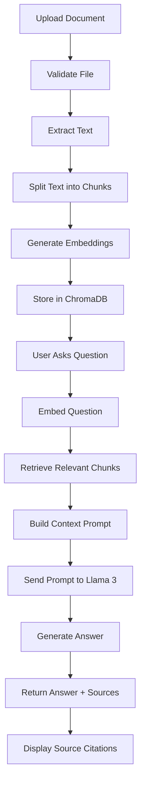

Intelligent Document Assistant using Local RAG and Llama 3
A production-style local AI document assistant built with FastAPI, React, ChromaDB, Ollama, and Llama 3.
<p>
  
  
  
  
  
  
  
  
  
</p>

</div>

Introduction
Intelligent Document Assistant using Local RAG and Llama 3 is a full-stack AI application that enables users to upload documents and ask natural-language questions about their content using a local Retrieval-Augmented Generation pipeline.
Local RAG improves traditional chatbot behavior by grounding answers in user-provided documents. Instead of generating responses only from model memory, the system retrieves relevant document chunks from a vector database and provides them as context to the language model. This helps produce more accurate, explainable, and document-aware answers.
The project is powered by React, Tailwind CSS, FastAPI, SQLite, ChromaDB, Ollama, Llama 3, and the local embedding model nomic-embed-text.
This project is designed as a local-first document intelligence assistant: private, lightweight, explainable, and suitable for portfolio or placement demonstrations.

Table of Contents
Project Objectives
Key Features
Why This Project?
System Architecture
Complete RAG Pipeline
Project Workflow
Project Architecture
Folder Structure
Tech Stack
Design Principles
Installation
Environment Variables
API Documentation
How RAG Works
Multi-Document Retrieval
Source Citations
ChromaDB
Ollama
Performance
Challenges Faced
Future Enhancements
Screenshots
Author
License
Project Objectives
The main objective of this project is to build a professional Local RAG assistant that can process user-uploaded documents and answer questions using retrieved context.
The project focuses on:
Building an end-to-end Retrieval-Augmented Generation pipeline.
Running LLM inference locally through Ollama.
Supporting multiple document formats.
Storing embeddings in a persistent vector database.
Maintaining chat history using SQLite.
Providing source citations for explainability.
Delivering a clean React interface inspired by modern AI assistants.
Keeping the architecture modular, lightweight, and easy to explain.
Key Features
Feature	Description
Local Llama 3 Inference	Uses Ollama to run Llama 3 locally for answer generation.
Retrieval-Augmented Generation	Retrieves relevant document chunks before generating answers.
Multi-Document Upload	Supports uploading and indexing multiple documents.
PDF Support	Extracts text from PDF files with page-aware metadata where available.
DOCX Support	Extracts text from Word documents.
TXT Support	Supports plain text files with encoding fallbacks.
Semantic Search	Uses ChromaDB to retrieve semantically relevant chunks.
Local Embeddings	Uses nomic-embed-text through Ollama.
SQLite Chat History	Persists chat questions, answers, sources, and sessions.
Multiple Chat Sessions	Supports separate conversations that can be reopened.
Source Citations	Displays compact source references with document name, page, and excerpt.
Document Filtering	Allows selected documents to participate in retrieval.
Document Management	Supports deleting individual documents and removing their vectors.
Delete All Documents	Provides an endpoint to delete all indexed documents.
Responsive UI	Built with React and Tailwind CSS for laptop, desktop, and tablet screens.
Environment-Based Config	Uses .env and centralized settings in config.py.

Why This Project?



Traditional chatbots answer from model memory alone. They may hallucinate, miss document-specific details, or provide answers that are difficult to verify.
This project improves that workflow by combining:
Document retrieval
Semantic search
Local embeddings
Llama 3 generation
Source citations
Local-first inference
The result is a document assistant that can answer based on uploaded files rather than relying only on general model knowledge.
System Architecture



Complete RAG Pipeline



Project Workflow
Document Upload
The user uploads PDF, DOCX, or TXT documents from the React frontend.

Validation
The backend checks file type, file name, duplicate uploads, empty files, and file size.

Extraction
Text is extracted based on the document type.

Chunking
Extracted text is split into smaller chunks for retrieval.

Embeddings
Each chunk is embedded using nomic-embed-text through Ollama.

Vector Storage
Chunk embeddings and metadata are stored in ChromaDB.

Retrieval
When the user asks a question, the backend retrieves semantically relevant chunks.

Prompt Construction
Retrieved chunks are formatted into a context prompt.

LLM Generation
Llama 3 generates an answer using the retrieved context.

Response
   The answer is returned to the frontend.

Source Citation
   The UI displays compact source cards with document name, page number, and excerpt.

Project Architecture
Backend Modules
File	Responsibility
config.py	Loads .env, centralizes settings, resolves paths, and provides sensible defaults.
main.py	Defines FastAPI app, CORS, startup behavior, and API endpoints.
database.py	Manages SQLite models for chat history, sessions, and indexed documents.
document_loader.py	Handles file validation, text extraction, and chunk creation.
embeddings.py	Generates document and query embeddings using Ollama.
vector_store.py	Handles ChromaDB persistence, search, count, and deletion.
rag.py	Coordinates retrieval, context construction, answer generation, and source metadata.
llm.py	Connects to Llama 3 through Ollama for final response generation.

Frontend Folders
Folder/File	Responsibility
src/App.jsx	Main application state, uploads, chat flow, sessions, and layout.
src/components/	Reusable UI components such as sidebar, chat messages, upload panel, input, alerts, and toast.
src/services/	Axios API service layer.
src/utils/	Formatting and citation normalization helpers.
src/styles.css	Tailwind CSS and global styles.

<details>
<summary><strong>Component Overview</strong></summary>

Component	Purpose
UploadPanel.jsx	Landing upload experience and drag-and-drop area.
Sidebar.jsx	Documents, chat history, document filters, and upload-more action.
MessageList.jsx	Chat messages and collapsible source citations.
ChatInput.jsx	Fixed bottom question input.
TopBar.jsx	Responsive top navigation area.
Alert.jsx	Displays backend or frontend errors.
Toast.jsx	Displays success notifications.
Spinner.jsx	Loading indicator component.

</details>

Folder Structure
Local RAG with LLaMa3/
├── backend/
│   ├── config.py              # Centralized environment configuration
│   ├── database.py            # SQLite history, sessions, and document records
│   ├── document_loader.py     # PDF, DOCX, TXT extraction and chunking
│   ├── embeddings.py          # Ollama embedding model integration
│   ├── llm.py                 # Llama 3 response generation
│   ├── main.py                # FastAPI app and routes
│   ├── rag.py                 # RAG orchestration and source metadata
│   ├── requirements.txt       # Python dependencies
│   └── vector_store.py        # ChromaDB storage and semantic search
│
├── frontend/
│   ├── index.html             # Vite entry HTML
│   ├── package.json           # Frontend dependencies and scripts
│   ├── postcss.config.js      # PostCSS configuration
│   ├── tailwind.config.js     # Tailwind configuration
│   └── src/
│       ├── App.jsx            # Main React application
│       ├── main.jsx           # React entry point
│       ├── styles.css         # Tailwind CSS imports
│       ├── components/
│       │   ├── Alert.jsx
│       │   ├── ChatInput.jsx
│       │   ├── MessageList.jsx
│       │   ├── Sidebar.jsx
│       │   ├── Spinner.jsx
│       │   ├── Toast.jsx
│       │   ├── TopBar.jsx
│       │   └── UploadPanel.jsx
│       ├── services/
│       │   └── api.js         # Axios API client
│       └── utils/
│           └── format.js      # Formatting helpers
│
├── chroma_db/                 # Persistent ChromaDB vector storage
├── uploads/                   # Uploaded documents
├── .env                       # Local environment variables
├── .env.example               # Example environment variables
├── .gitignore
├── README.md
└── rag_history.sqlite3        # SQLite database
Tech Stack
Technology	Purpose	Why It Was Chosen
Python	Backend language	Strong AI and API ecosystem
FastAPI	REST API backend	Fast, modern, typed API development
React	Frontend UI	Component-based interactive interface
Vite	Frontend tooling	Fast development and build performance
Tailwind CSS	Styling	Clean, responsive utility-first styling
Axios	API communication	Simple HTTP client for frontend requests
Ollama	Local model runtime	Runs LLMs and embeddings locally
Llama 3	Answer generation	Strong local language model support
nomic-embed-text	Embeddings	Local semantic embeddings through Ollama
ChromaDB	Vector database	Lightweight persistent semantic search
SQLite	Chat history database	Simple local persistence
SQLAlchemy	ORM	Structured database access
PyPDF	PDF text extraction	Extracts text and page-level content
python-docx	DOCX parsing	Reads Word document text
LangChain Text Splitters	Chunking	Splits long text into retrievable chunks

Design Principles
Modular Architecture
Backend responsibilities are separated into focused modules.

Separation of Concerns
UI, API, database, embeddings, vector search, and generation are isolated.

Local-First AI
The system runs locally using Ollama, ChromaDB, and SQLite.

Retrieval-Augmented Generation
The assistant answers using retrieved document context.

Explainable AI through Source Citations
Responses include source references so users can verify answers.

Environment-Based Configuration
Runtime settings are loaded from .env.

Reusable Components
The frontend uses reusable React components.

Scalable Document Processing
Multiple documents can be uploaded, indexed, filtered, and searched.

Installation
1. Clone Repository
git clone <your-repository-url>
cd "Local RAG with LLaMa3"
2. Create Virtual Environment
cd backend
python -m venv .venv
Activate it:
Windows PowerShell
.\.venv\Scripts\Activate.ps1
macOS/Linux
source .venv/bin/activate
3. Install Backend Dependencies
pip install -r requirements.txt
4. Install Frontend Dependencies
cd ../frontend
npm install
5. Install Ollama
Download and install Ollama:
https://ollama.com/download
6. Pull Required Models
ollama pull llama3
ollama pull nomic-embed-text
7. Run Ollama
If Ollama is not already running:
ollama serve
8. Create .env
From the project root:
copy .env.example .env
For macOS/Linux:
cp .env.example .env
9. Run Backend
cd backend
uvicorn main:app --reload
Backend URL:
http://127.0.0.1:8000
API docs:
http://127.0.0.1:8000/docs
10. Run Frontend
cd frontend
npm run dev
Frontend URL:
http://127.0.0.1:5173
Environment Variables
Variable	Purpose	Default	Example
APP_NAME	FastAPI application name	Local RAG with Llama 3	Local RAG with Llama 3
OLLAMA_BASE_URL	URL for local Ollama server	http://localhost:11434	http://localhost:11434
LLM_MODEL	Model used for answer generation	llama3	llama3
EMBEDDING_MODEL	Model used for embeddings	nomic-embed-text	nomic-embed-text
UPLOAD_DIR	Directory for uploaded files	uploads	uploads
CHROMA_DB_DIR	Directory for ChromaDB persistence	chroma_db	chroma_db
DATABASE_PATH	SQLite database path	rag_history.sqlite3	rag_history.sqlite3
DATABASE_URL	Optional full SQLAlchemy database URL	Not set	sqlite:///rag_history.sqlite3
CHROMA_COLLECTION	ChromaDB collection name	local_documents	local_documents
CHUNK_SIZE	Maximum chunk size	900	900
CHUNK_OVERLAP	Overlap between chunks	150	150
RETRIEVAL_K	Number of chunks retrieved	5	5
MAX_RELEVANCE_DISTANCE	Retrieval relevance cutoff	1.35	1.35
MAX_UPLOAD_SIZE_MB	Maximum file upload size	50	50
PDF_EXTENSION	PDF file extension	.pdf	.pdf
DOCX_EXTENSION	DOCX file extension	.docx	.docx
TXT_EXTENSION	TXT file extension	.txt	.txt
ALLOWED_EXTENSIONS	Supported file extensions	.pdf,.docx,.txt	.pdf,.docx,.txt

The current implementation uses RETRIEVAL_K and MAX_RELEVANCE_DISTANCE for retrieval configuration.

API Documentation
Method	Endpoint	Description	Request	Response
GET	/health	Checks backend, ChromaDB, and Ollama status	None	Health metadata
POST	/upload	Uploads and indexes one or more documents	Multipart form data with file or files	Indexed document metadata
POST	/ask	Asks a question over indexed documents	JSON with question, optional session_id, optional document filters	Answer, sources, session ID
GET	/documents	Lists indexed documents	None	Document list
DELETE	/documents	Deletes all indexed documents	None	Deleted count
DELETE	/document/{filename}	Deletes one document and its vectors	Filename path parameter	Deleted filename
GET	/history	Retrieves chat history and sessions	None	Session and message history
DELETE	/history	Clears chat history	None	Deleted history count
POST	/sessions	Creates a new chat session	None	Session metadata
GET	/sessions/{session_id}	Retrieves messages for a session	Session ID path parameter	Session messages

How RAG Works
Documents are uploaded through the frontend.
The backend validates files to ensure only supported formats are processed.
Text is extracted from PDF, DOCX, or TXT files.
Text is chunked into smaller sections.
Embeddings are generated using nomic-embed-text.
Vectors are stored in ChromaDB with metadata.
The user asks a question in the chat interface.
The question is embedded using the same embedding model.
Relevant chunks are retrieved from ChromaDB.
A prompt is constructed using retrieved document context.
Llama 3 generates an answer through Ollama.
The frontend displays the answer with source citations.
Multi-Document Retrieval
The application supports multiple uploaded documents.
Each document is indexed independently with metadata such as:
Filename
Document name
Source file
Page number when available
Chunk identifier
Timestamp
Retrieval can search across:
All uploaded documents
Only selected documents when filters are applied
If no document filter is selected, the system searches across every indexed document.
Source Citations
Source citations help users understand where an answer came from.
The system stores and returns metadata for retrieved chunks. The frontend displays citations as compact cards with:
Document name
Page number when available
Short relevant excerpt
PDF page references are preserved when available because PDF text is extracted page by page.
For DOCX and TXT documents, page numbers may be unavailable because these formats do not provide reliable page-level structure during plain text extraction.
ChromaDB
ChromaDB is used as the local vector database.
It stores document chunks, embeddings, and metadata for semantic retrieval.
ChromaDB was selected because it is:
Lightweight
Local-first
Persistent
Easy to integrate with Python
Suitable for semantic search workflows
Semantic search allows the assistant to retrieve text based on meaning instead of relying only on exact keyword matches.
Ollama
Ollama is used to run local AI models.
This project uses Ollama for:
Llama 3 answer generation
nomic-embed-text embedding generation
Ollama was selected because it provides a simple local model runtime without requiring external API keys.
Benefits:
Local inference
No external LLM API dependency
Better privacy
Lower operating cost
Simple model management
Performance
Area	Approach
Chunking	Large documents are split into smaller retrievable chunks
Retrieval	Only the most relevant chunks are passed to the LLM
Reduced Hallucinations	Answers are grounded in retrieved document context
Fast Semantic Search	ChromaDB enables local vector similarity search
Local Inference	Ollama avoids external API latency and API costs
Persistent Storage	ChromaDB and SQLite preserve vectors and history locally

Challenges Faced
Challenge	Solution
Supporting multiple file formats	Added PDF, DOCX, and TXT extraction
Preserving PDF page references	Extracted PDF content page by page
Avoiding generic chatbot responses	Implemented Retrieval-Augmented Generation
Managing multiple documents	Indexed each file independently with metadata
Removing deleted document data	Deleted both SQLite metadata and ChromaDB vectors
Running without paid APIs	Used Ollama for local LLM and embedding inference
Persisting chat history	Used SQLite with chat sessions
Keeping configuration maintainable	Centralized settings through .env and config.py
Presenting citations clearly	Used compact source cards with short excerpts

Future Enhancements
OCR support for scanned PDFs
Image understanding for multimodal documents
Streaming responses from Llama 3
Role-based authentication
Document collections or workspaces
Cloud deployment
Hybrid keyword and vector search
Voice-based interaction
Chat export
Advanced document preview
User accounts
File re-indexing workflow
Retrieval quality evaluation dashboard
Screenshots
Home
Add screenshot here
Upload
Add screenshot here
Chat
Add screenshot here
Sources
Add screenshot here
Sidebar
Add screenshot here
Author
Jahnavi Polisetty
LinkedIn: Add LinkedIn profile here
GitHub: JahnaviPolisetty
License
This project is licensed under the MIT License.

## Prerequisites

- Python 3.10+
- Node.js 18+
- Ollama installed and running

## Environment Configuration

Backend configuration is loaded from the root `.env` file by `backend/config.py` using `python-dotenv`. All other backend modules import settings from `config.py`; they should not hardcode model names, paths, database locations, or Ollama URLs.

Create your local environment file from the example:

```bash
copy .env.example .env
```

macOS/Linux:

```bash
cp .env.example .env
```

Available variables:

```bash
APP_NAME=Local RAG with Llama 3
OLLAMA_BASE_URL=http://localhost:11434
LLM_MODEL=llama3
EMBEDDING_MODEL=nomic-embed-text
UPLOAD_DIR=uploads
CHROMA_DB_DIR=chroma_db
DATABASE_PATH=rag_history.sqlite3
CHROMA_COLLECTION=local_documents
CHUNK_SIZE=900
CHUNK_OVERLAP=150
RETRIEVAL_K=5
MAX_RELEVANCE_DISTANCE=1.35
MAX_UPLOAD_SIZE_MB=50
PDF_EXTENSION=.pdf
DOCX_EXTENSION=.docx
TXT_EXTENSION=.txt
ALLOWED_EXTENSIONS=.pdf,.docx,.txt
```

`DATABASE_URL` can also be set for a full SQLAlchemy database URL. If omitted, the app uses `DATABASE_PATH` and builds a SQLite URL automatically.

All path values may be absolute or relative. Relative paths are resolved from the project root.

## Ollama Setup

Install Ollama from https://ollama.com/download, then start Ollama and pull the required models:

```bash
ollama pull llama3
ollama pull nomic-embed-text
```

Confirm Ollama is available:

```bash
ollama list
```

## Backend Setup

From the project root:

```bash
cd backend
python -m venv .venv
```

Activate the virtual environment.

Windows PowerShell:

```powershell
.\.venv\Scripts\Activate.ps1
```

macOS/Linux:

```bash
source .venv/bin/activate
```

Install backend dependencies:

```bash
pip install -r requirements.txt
```

Run the FastAPI backend:

```bash
uvicorn main:app --reload
```

Backend API docs will be available at:

```text
http://127.0.0.1:8000/docs
```

## Frontend Setup

From the project root:

```bash
cd frontend
npm install
npm run dev
```

## API Endpoints

- `POST /upload` uploads and indexes PDF, DOCX, or TXT files.
- `POST /ask` asks a question using the indexed documents.
- `GET /history` returns chat history.
- `DELETE /history` clears chat history.
- `GET /documents` lists indexed documents.
- `DELETE /documents` deletes all indexed documents.
- `DELETE /document/{filename}` deletes one document and its vectors.
- `GET /health` returns backend and vector-store health.
